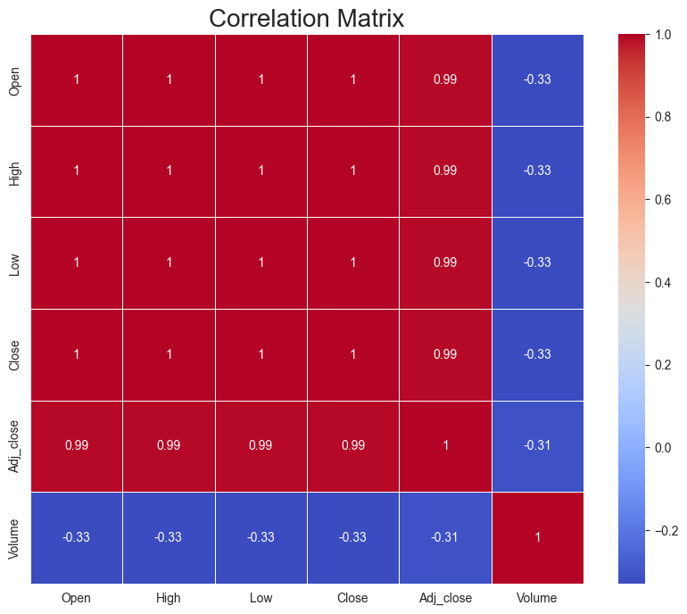
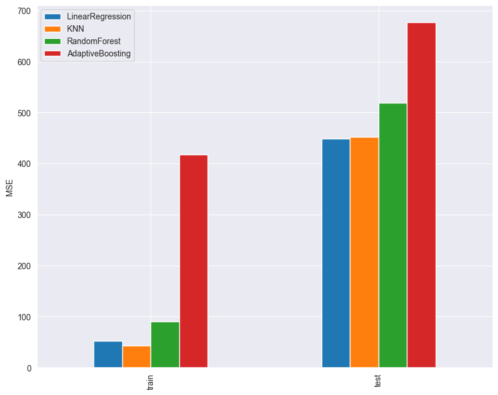

# Laporan Proyek Machine Learning - Aimar Abimayu Pratama

## Domain Proyek

Saham adalah surat berharga yang menunjukkan bukti kepemilikan seseorang atau badan usaha atas suatu perusahaan. Saham juga dapat diartikan sebagai tanda penyertaan modal seseorang atau badan usaha dalam suatu perusahaan atau perseroan terbatas. Saham merupakan salah satu instrumen investasi yang banyak diminati oleh masyarakat karena memiliki potensi keuntungan yang tinggi. Namun, investasi saham juga memiliki risiko yang tinggi. Oleh karena itu, investor perlu melakukan analisis terhadap saham yang akan dibeli. Dengan melakukan predictive analysis, investor dapat memprediksi harga saham di masa depan sehingga dapat membantu investor dalam mengambil keputusan.

Referensi:
 - [Implementasi Algoritma Linear Regression Untuk Prediksi Harga Saham Pt. Aneka Tambang Tbk](https://journals.usm.ac.id/index.php/transformatika/article/view/4396)
 - [Prediksi Harga Saham Bank Bri Menggunakan Algoritma Linear Regresion Sebagai Strategi Jual Beli Saham](https://doi.org/10.20895/dinda.v2i1.273)
 - [Recurrent Neural Network With Gate Recurrent Unit For Stock Price Prediction](https://doi.org/10.31315/telematika.v18i3.6650)

## Business Understanding

Untuk menyusun strategi trading pada saham perusahaan United Tractors, diperlukan beberapa data dan salah satunya adalah prediksi harga saham kedepannya. Ada beberapa komponen pada saham yaitu harga pembukaan, harga penutupan, harga tertinggi, harga terendah, dan volume. Dengan adanya sistem yang dapat memprediksi harga penutupan saham United Tractors, tentunya dapat membantu mendapatkan profit yang lebih maksimal.

### Problem Statements
- Dari beberapa faktor yang ada, faktor apa yang paling berpengaruh terhadap prediksi harga penutupan saham United Tractors?
- Berapa harga penutupan yang didapat jika kita mempunyai beberapa komponen faktor tertentu?

### Goals
- Mengetahui faktor yang paling berpengaruh terhadap harga penutupan saham United Tractors.
- Membuat model machine learning yang mampu untuk memprediksi harga penutupan dengan akurat berdasarkan data yang ada.

### Solution statements
- Melakukan ekplorasi data untuk mengetahui faktor yang paling berpengaruh terhadap harga penutupan saham United Tractors seperti korelasi dan deskripsi statistik data.
- Melakukan pemodelan menggunakan beberapa model yaitu linear regression, K-Nearest Neighbours, Ramdom Forest, dan Adaptive Boosting.

## Data Understanding

Data merupakan kumpulan harga saham United Tractors pada saat perdagangan saham. Data didapat dari [Kaggle](https://www.kaggle.com/datasets/rischan/indonesia-popular-stocks) dengan rentang waktu 20 tahun dari 5 September 2000 sampai 3 Juli 2020. Data yang didapat berjumlah 4980 baris dan 7 kolom. Seluruh data bersifat numerik dengan tipe data float.

### Variabel-variabel pada UNTR dataset adalah sebagai berikut:
- Date : merupakan tanggal pada data diambil.
- Open : merupakan harga saham pada pembukaan perdagangan.
- High : merupakan harga saham tertinggi pada hari tersebut.
- Low : merupakan harga saham terendah pada hari tersebut.
- Close : merupakan harga saham pada penutupan perdagangan.
- Adj Close : merupakan harga saham penutupan yang telah disesuaikan dengan kondisi pasar atau aksi korporasi.
- Volume : merupakan jumlah saham yang diperdagangkan pada hari tersebut.

### Eksplorasi Data
- Melihat deskripsi statistik dari data.
- Membuang kolom yang memiliki nilai null.
- Melakukan cek outlier pada data.
- Melihat visualisasi korelasi antar variabel dan memutuskan untuk menggunakan variabel Open, High, dan Low sebagi fitur.

  

- Membuang kolom yang tidak digunakan yaitu kolom Date, Adj Close, dan Volume.

## Data Preparation

- Melakukan reduksi dimensi fitur menggunakan PCA. Tahapan ini diperlukan untuk mempercepat proses komputasi. Fitur yang direduksi adalah Open, High, dan Low. Hasil reduksi dimensi fitur menjadi 3 komponen dan diambil komponen yang paling pertama.
- Data yang sudah direduksi kemudian dibagi secara acak menjadi data train dan data test dengan rasio 80:20 menggunakan fungsi train_test_split. Pembagian data ini dilakukan untuk menghindari overfitting dan underfitting, selain itu berguna juga untuk mengukur tingkat keberhasilan model dalam prediksi.
- Melakukan scaling pada data train menggunakan StandardScaler. Scaling dilakukan untuk menghindari perbedaan skala data yang dapat mempengaruhi performa model.

## Modeling

Model yang digunakan adalah Linear Regression, K-Nearest Neighbours, Random Forest, dan Adaptive Boosting. Model-model tersebut digunakan karena dapat digunakan untuk melakukan prediksi pada data numerik. Selain itu, model-model tersebut juga dapat digunakan untuk melakukan prediksi pada data yang memiliki banyak fitur.

- #### Linear Regression
Pada model Linear Regression, digunakan parameter  fit_intercept=True, normalize=False, dan copy_X=True. Parameter-parameter tersebut digunakan karena merupakan parameter default dari model Linear Regression. Parameter normalize bernilai False karena data sudah di scaling sebelumnya. Parameter fit_intercept bernilai True karena data yang digunakan memiliki nilai intercept. Parameter copy_X bernilai True karena data yang digunakan untuk copy data sebelum diproses model. Kelebihan dari model ini adalah sederhana dan mudah diinterpretasikan. Kekurangan dari model ini adalah sensitif terhadap outliers dan tidak dapat menangani non-linear data.

- #### K-Nearest Neighbours
Model ini menggunakan parameter n_neighbours=5, weights=uniform, dan algorithm=auto. Parameter n_neighbours bernilai 5 digunakan untuk menentukan jumlah tertangga terdekat. Parameter weights bernilai uniform karena merupakan parameter default dari model K-Nearest Neighbours. Parameter algorithm bernilai auto karena merupakan parameter default dari model K-Nearest Neighbours. Kelebihan dari model ini adalah mudah diimplementasikan, dapat digunakan untuk data yang tidak linear, dan cocok untuk data dengan distribusi tidak normal. Kekurangan dari model ini adalah sensitif terhadap outliers, tidak dapat menangani data yang memiliki banyak fitur, dan sensitif terhadap skala data.

- #### Random Forest
Model ini menggunakan parameter n_estimators=100, max_depth=5, dan random_state=42. Parameter n_estimators bernilai 100 karena decision tree yang digunakan berjumlah 100. Parameter max_depth bernilai 5 untuk menentukan kalau kedalaman maksimum dari pohon pada ensemble. Parameter random_state bernilai 42 untuk melakukan randomisasi pada model. Kelebihan dari model ini adalah dapat digunakan untuk data yang tidak linear, dapat digunakan untuk data yang memiliki banyak fitur, dan dapat digunakan untuk data yang memiliki banyak outliers. Kekurangan dari model ini adalah kompleks dan sulit diinterpretasikan.

- #### Adaptive Boosting
Pada model ini menggunakan parameter n_estimators=100, learning_rate=1, dan random_state=42. Parameter n_estimators bernilai 100 karena decision tree untuk ensemble learning yang digunakan berjumlah 100. Parameter learning_rate bernilai 1 karena merupakan parameter default dari model Adaptive Boosting. Parameter random_state bernilai 42 untuk melakukan randomisasi pada tiap iterasi learning. Kelebihan dari model ini adalah dapat digunakan untuk data yang tidak linear, mengurangi overfitting karena mempertimbangkan model2 lemah dan menggabungkannya, dan mampu meningkatkan performa pada kasus regresi dengan mengambil kelebihan dari ensemble learning. Kekurangan dari model ini adalah rentan terhadap noise dan sensitif terhadap overfitting jika n_estimator terlalu besar atau learning_rate terlalu tinggi

Berdasarkan dari variasi model yang sudah dicoba sebelumnya, didapat kalau model yang paling baik adalah linear regression dan KNN. Dua model tersebut mendapatkan MSE training masing2 sebesar 51 dan 43, untuk MSE test masing2 sebesar 448 dan 451.

## Evaluation

Metrik evaluasi menggunakan Mean Squared Error (MSE). MSE digunakan karena MSE dapat mengukur seberapa jauh rata-rata kuadrat dari error. Selain itu, MSE juga dapat mengukur seberapa dekat data dengan garis regresi. Semakin kecil nilai MSE, maka semakin baik model yang digunakan.

Formula MSE adalah sebagai berikut:

MSE = 1/n * Σ(yi - y^i)^2

Untuk perbandingan, digunakan nilai MSE pada training dan testing. Nilai MSE pada training digunakan untuk melihat seberapa baik model dalam mempelajari data. Sedangkan nilai MSE pada testing digunakan untuk melihat seberapa baik model dalam memprediksi data. Dari tiap model didapatkan nilai MSE pada training dan testing masing2 adalah 51.92 dan 448.58 pada Linear Regression, 43.2 dan 451.61 pada KNN, 90.28 dan 518.32 pada Random Forest, dan 417.14 dan 676.14 pada Adaptive Boosting.

  

Berdasarkan hasil yang didapat, dapat disimpulkan model Linear Regression dan KNN nyaris setara performanya. Hanya saja, model Linear Regression lebih baik dalam memprediksi data sedangkan model KNN lebih baik dalam mempelajari data. Sedangkan model Random Forest dan Adaptive Boosting memiliki performa yang lebih buruk dibandingkan model Linear Regression dan KNN.